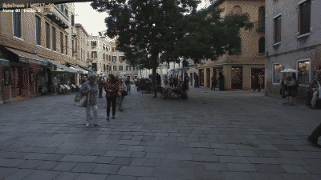

# Real-time Multi-Object Tracking Pipeline

End-to-end pipeline for pedestrian detection and tracking in video.  
Implements and compares **SORT**, **ByteTrack**, and **DeepSORT** on the MOT17 benchmark.



> ByteTrack tracking pedestrians on MOT17-02 sequence. Each colour = unique track ID.  
> Input: ground-truth bounding boxes → tracker maintains stable identities through occlusions.

---

## Results on MOT17 train (DPM detector, 7 sequences)

| Tracker | MOTA ↑ | IDF1 ↑ | ID Switches ↓ | FP ↓ | Precision ↑ |
|---------|--------|--------|--------------|------|-------------|
| SORT | +0.204 | 0.339 | 1140 | 23724 | 0.688 |
| **ByteTrack** | **+0.283** | **0.354** | **275** | **2384** | **0.933** |

ByteTrack reduces ID switches by **4×** and false positives by **10×** vs SORT.

> DeepSORT with a generic ResNet18 (ImageNet pretrained) underperforms SORT — appearance
> features are only beneficial with a Re-ID–tuned backbone (e.g. trained on MARS/DukeMTMC).

---

## Architecture

```
Video / MOT17 frames
        │
        ▼
┌─────────────────┐
│  YOLOv8Detector │  ← ultralytics, filters class=person
│  (detector.py)  │  → (N, 6): [x1,y1,x2,y2, conf, class]
└────────┬────────┘
         │
         ▼
┌──────────────────────────────────────────┐
│            Tracker                       │
│                                          │
│  ┌──────────────┐   ┌─────────────────┐  │
│  │ Kalman Filter│   │  Data Associate │  │
│  │  predict()   │──▶│  IoU cost matrix│  │
│  │  update()    │   │  Hungarian algo │  │
│  └──────────────┘   └────────┬────────┘  │
│                              │           │
│         ByteTrack:  Stage 1 (high-conf)  │
│                     Stage 2 (low-conf)   │
└──────────────────────────────────────────┘
         │
         ▼
  Confirmed Tracks  →  draw_tracks()  →  Annotated frame
```

**Track state machine:** `Tentative → Confirmed → Lost → Deleted`

---

## Algorithms implemented from scratch

### Kalman Filter (`src/tracking/kalman_filter.py`)
State vector: `[cx, cy, aspect_ratio, height, vx, vy, va, vh]`  
Predict → Update cycle with constant-velocity motion model.  
Mahalanobis gating distance for rejecting impossible matches.

### Hungarian Algorithm (`src/association/hungarian.py`)
Optimal assignment of detections to tracks via `scipy.optimize.linear_sum_assignment`.  
Cost matrix: `1 - IoU`. Threshold filters out poor matches.

### IoU Matching (`src/association/iou_matching.py`)
Vectorised NumPy computation of pairwise IoU for all track × detection pairs.

### SORT (`src/tracking/sort.py`)
Kalman filter + IoU matching + Hungarian assignment.  
Single-stage matching on all detections above confidence threshold.

### ByteTrack (`src/tracking/bytetrack.py`)
Two-stage matching — key improvement over SORT:
- **Stage 1:** high-confidence detections `(conf ≥ 0.5)` → confirmed + lost tracks
- **Stage 2:** low-confidence detections `(conf ≥ 0.1)` → unmatched tracks

Stage 2 rescues partially occluded tracks that SORT would lose.

### DeepSORT (`src/tracking/deepsort.py`)
Cascade matching (by track age) + combined cost:  
`λ · IoU_cost + (1-λ) · cosine_distance`  
Re-ID appearance gallery (ring buffer) per track.

---

## Quick Start

### Install

```bash
pip install -r requirements.txt
```

### Track a video

```bash
python scripts/run_tracker.py --input video.mp4 --tracker bytetrack --output result.mp4
```

### Track a MOT17 sequence

```bash
python scripts/run_tracker.py \
    --mot17 "data/MOT17 2/train/MOT17-02-DPM" \
    --tracker bytetrack \
    --show
```

### Evaluate on MOT17

```bash
# Fast: use pre-computed detections from det.txt
python scripts/evaluate.py --detector DPM --use-gt-dets --trackers sort bytetrack

# With YOLOv8 detections
python scripts/evaluate.py --detector DPM --trackers sort bytetrack
```

### Streamlit demo

```bash
streamlit run scripts/run_streamlit.py
```

Upload any video → choose tracker + params → watch tracking live.

---

## Project structure

```
realtime-object-tracker/
├── configs/default.yaml          # tracker, detector, path params
├── src/
│   ├── data_loader.py            # MOT17Sequence / MOT17Dataset
│   ├── detection/detector.py     # YOLOv8Detector
│   ├── tracking/
│   │   ├── kalman_filter.py      # Kalman filter (predict / update)
│   │   ├── sort.py               # SORT tracker + Track state machine
│   │   ├── bytetrack.py          # ByteTrack (two-stage matching)
│   │   └── deepsort.py           # DeepSORT (cascade + appearance)
│   ├── association/
│   │   ├── iou_matching.py       # vectorised IoU + cost matrix
│   │   ├── hungarian.py          # Hungarian assignment wrapper
│   │   └── appearance.py         # ResNet18 Re-ID extractor + cosine dist
│   ├── evaluation/metrics.py     # MOTAccumulator (motmetrics wrapper)
│   ├── pipeline/tracker.py       # TrackingPipeline (video → tracks)
│   └── visualization/draw.py     # draw_tracks, draw_detections, etc.
├── scripts/
│   ├── run_tracker.py            # CLI: video / MOT17 sequence
│   ├── evaluate.py               # CLI: MOT17 evaluation
│   └── run_streamlit.py          # Streamlit demo
└── tests/
    ├── test_kalman.py             # 15 tests
    ├── test_iou.py                # 14 tests
    └── test_hungarian.py         # 13 tests
```

---

## Tests

```bash
pytest tests/ -v
```

42 tests covering Kalman filter, IoU matching, and Hungarian assignment.

---

## Tech stack

| Component | Library |
|-----------|---------|
| Detection | `ultralytics` (YOLOv8) |
| Linear algebra | `numpy`, `scipy` |
| Re-ID backbone | `torchvision` (ResNet18) |
| Evaluation | `motmetrics` |
| Demo | `streamlit` |
| Tests | `pytest` |

---

## Key takeaways

1. **ByteTrack** is the practical choice — simple, fast, effective. No appearance features needed.  
2. **DeepSORT** only wins with a proper Re-ID model. Generic ImageNet features hurt more than help.  
3. **Kalman filter** smooths noisy detections and enables prediction through occlusions.  
4. **Hungarian algorithm** gives globally optimal assignment — greedy matching would cause avoidable ID switches.
